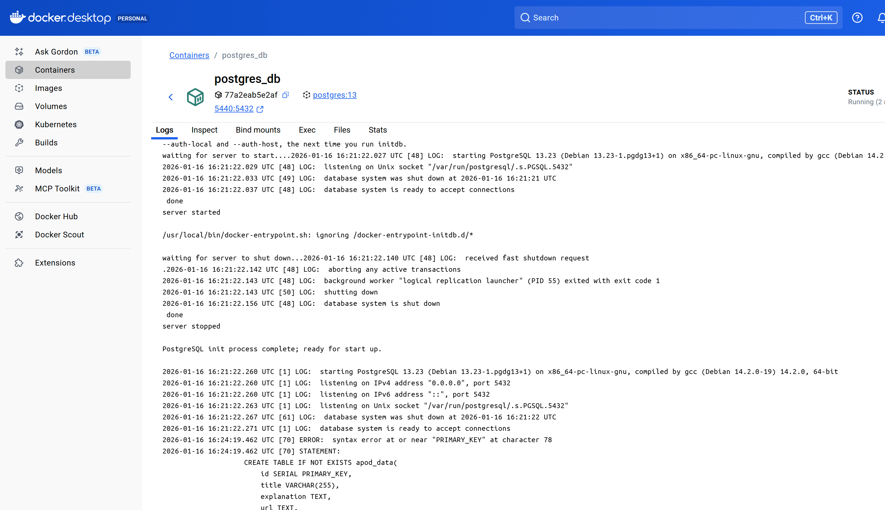
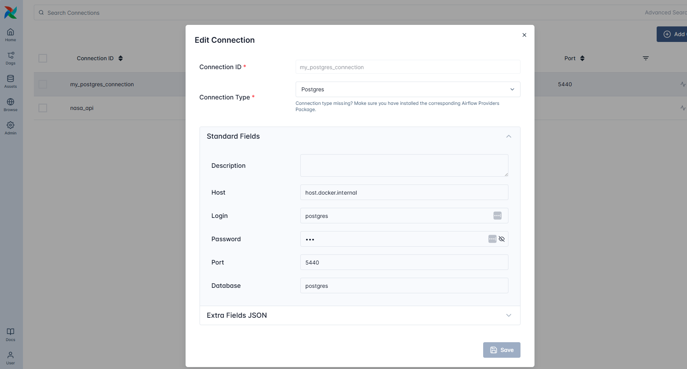
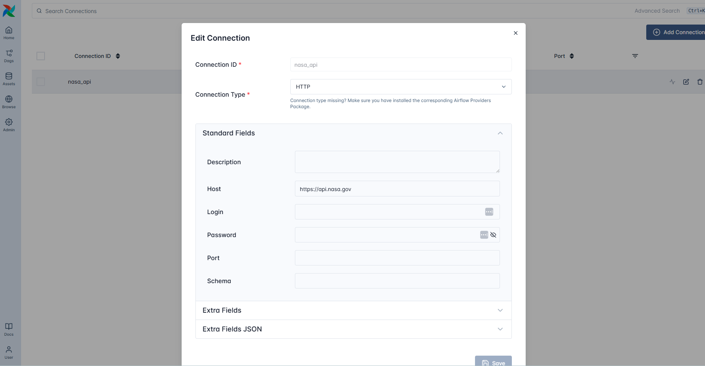
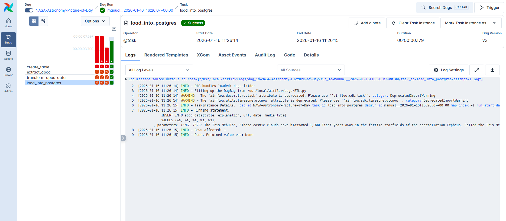
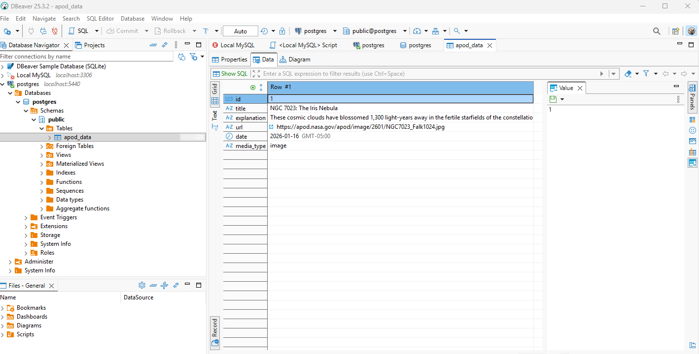
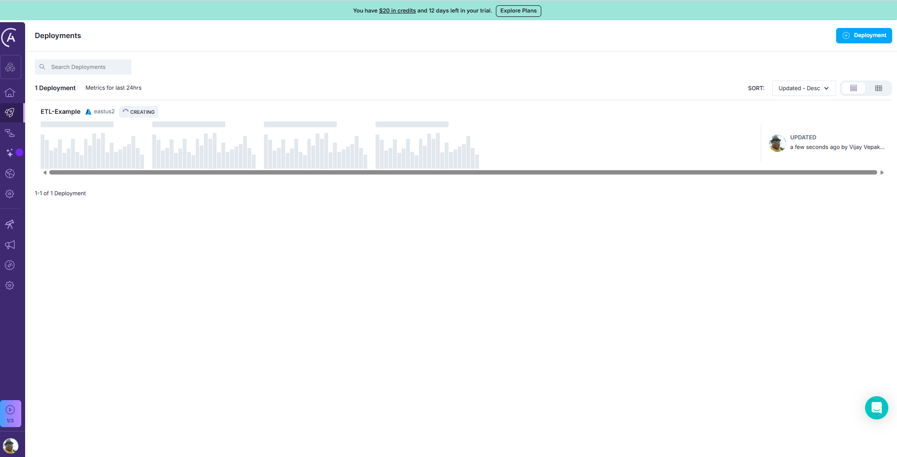

# Airflow with Astro

- [Astro CLI](https://www.astronomer.io/docs/astro/cli/install-cli)
- [Astro Cloud](https://www.astronomer.io/)

## Initialize Dev Project

```shell
astro dev init
```

## Start Project

- [Run Airflow Locally](https://www.astronomer.io/docs/astro/cli/run-airflow-locally)
- Update global config 

```shell
cp global/config.yaml ~/.astro/config.yaml
```

I had to change below items

```yaml
api-server:
  port: "38080"
postgres:
  host: host.docker.internal
webserver:
  port: "38080"

```

```shell
asttro dev start
```

## Add Dag
- Setup dependencies
```shell
python3 -m venv .venv
source .venv/Scripts/activate
pip3 install airflow
pip3 install airflow-operators

```

## Check Dag

- Some old Airflow concepts are completely removed and dags are not detected if they are used
- Fix by running
```shell
 astro dev upgrade-test

```

- I had to change `schedule_interval` to `schedule` for dag to be discovered

## Postgres

```shell
pip3 install apache-airflow[postgres]
```

- Run docker-compose to 

```shell
cd Astro
docker compose up -d
```



- Setup connection

```yaml
host: host.docker.internal
login: postgres
password: postgres
database: postgres
port: 5440
```




## NASA Api

- https://api.nasa.gov
- Setup

```shell
export NASA_API_KEY='your_nasa_api_key_from_email'
```

```shell
 curl https://api.nasa.gov/planetary/apod?api_key=${NASA_API_KEY}
```

- Update Dockerfile

```dockerfile
FROM astrocrpublic.azurecr.io/runtime:3.1-10
RUN pip install apache-airflow-providers-http
```

- Update connections



```yaml
name: nasa_api
host: https://api.nasa.gov
```

- Extra Fields Json

```json
{
  "api_key": "***"
}
```

## Run the DAG



- Verify data in DBeaver


## Deploy to Astro Cloud

```shell
astro login
astro deploy
```

- [Astro IO](https://cloud.astronomer.io/cmke2khdw4jvy01psuooju4lc/deployments)
